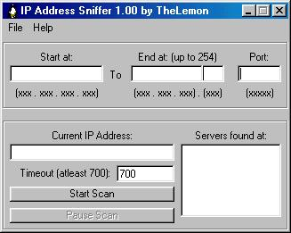



## IP address/port sniffer

### Description

This program is the opposite of my the other program I submitted (A port sniffer).

This program scans a range of IP addresses, such as 127.0.0.1 to 127.0.0.254, for servers running on a port of your choice, such as 4232. It is fairly fast, takes about 3 minutes to scan 254 addresses. It is a complete, working program, but it could use a little more speed. My other program (A port sniffer) has a good demonstation on how you'd go about speeding up the scan.

If you like this code, please vote for it, thanx! :)
 
### More Info
 
This program, after compiled, may trigger McAfee to think it's a virus. You can examine the code though, it is legitimate.

             |
---                |---
**Submitted On**   |2000-10-28 23:06:28
**By**             |[Corey Scott\-Walton](https://github.com/Planet-Source-Code/PSCIndex/blob/master/ByAuthor/corey-scott-walton.md)
**Level**          |Intermediate
**User Rating**    |4.7 (14 globes from 3 users)
**Compatibility**  |VB 5\.0, VB 6\.0
**Category**       |[Internet/ HTML](https://github.com/Planet-Source-Code/PSCIndex/blob/master/ByCategory/internet-html__1-34.md)
**World**          |[Visual Basic](https://github.com/Planet-Source-Code/PSCIndex/blob/master/ByWorld/visual-basic.md)
**Archive File**   |[CODE\_UPLOAD1108110292000\.zip](https://github.com/Planet-Source-Code/corey-scott-walton-ip-address-port-sniffer__1-12390/archive/master.zip)

